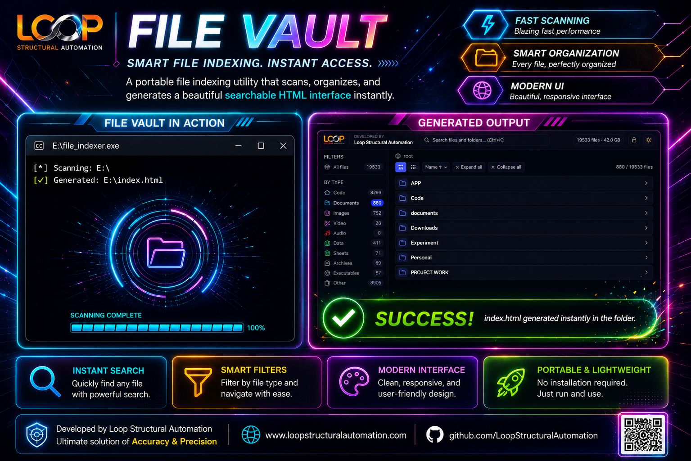

# Loop FileVault

Portable smart file indexing utility developed by Loop Structural Automation.

## Features

* Instant folder indexing
* Smart searchable HTML interface
* Modern dark UI
* File type categorization
* Fast scanning
* Portable EXE support
* No installation required

## How to Use

1. Copy `LoopFileVault.exe` into any folder
2. Double click application
3. `index.html` will be generated automatically
4. Open generated HTML file

## Preview

## Download

Download latest version from the Releases section.

## Developed By

Loop Structural Automation

https://www.loopstructuralautomation.com
